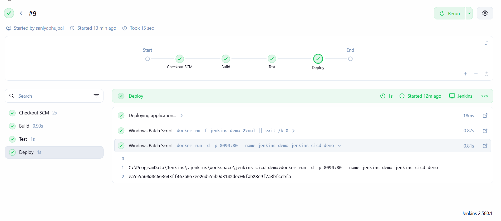
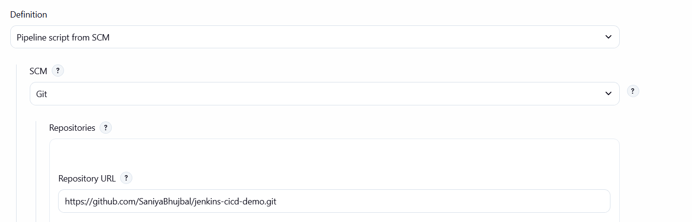
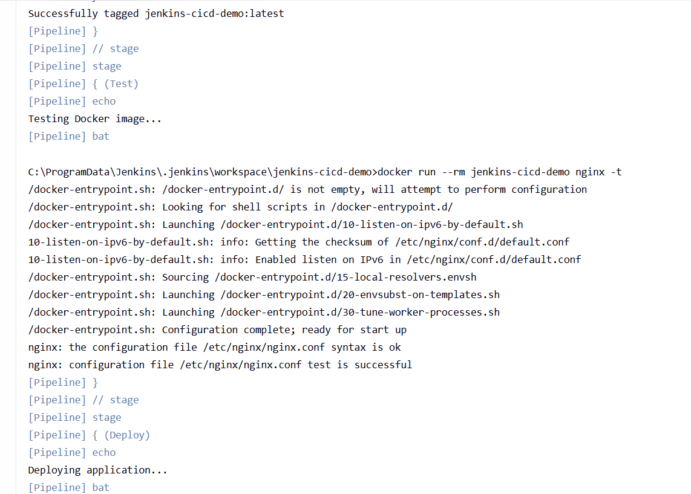
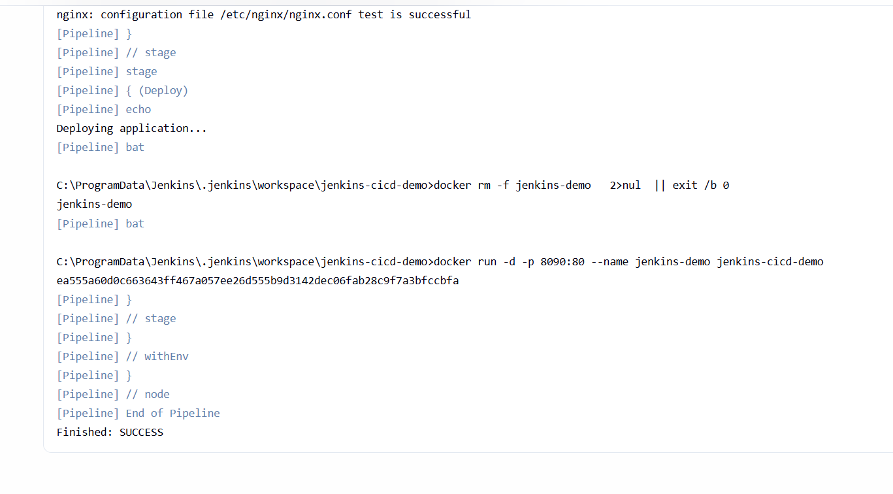
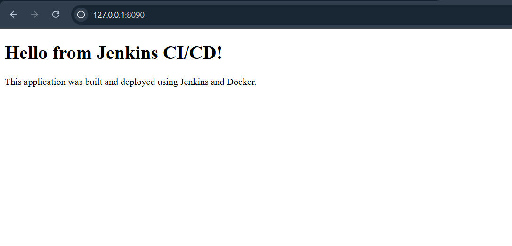

# Jenkins CI/CD Docker Demo

## Project Overview

This project demonstrates a CI/CD pipeline using Jenkins and Docker. The pipeline automatically builds a Docker image, tests the Nginx configuration, and deploys the application as a Docker container.

## Technologies Used

- Jenkins
- Docker
- Git
- GitHub
- Nginx
- HTML
- Windows

## Project Structure

jenkins-cicd-demo/
    app/
        index.html
    Screenshots/
        Jenkins_console_deploy.image.png
        Jenkins_console_test.image.png
        Jenkins_pipeline.image.png
        Pipeline_script_scm.image.png
        Running_application_chrome.image.png
    Dockerfile
    Jenkinsfile
    README.md

## CI/CD Pipeline

The Jenkins pipeline consists of three stages:

1. Build – Builds the Docker image.
2. Test – Tests the Nginx configuration inside the Docker container.
3. Deploy – Runs the application as a Docker container on port 8090.

## Jenkins Configuration

Jenkins is configured to:

- Pull the project from GitHub.
- Read the Jenkinsfile from the repository.
- Build the Docker image.
- Test the Nginx configuration.
- Deploy the application using Docker.

## Application

The application is a simple HTML webpage served using Nginx inside a Docker container.

## Result

The Jenkins pipeline completed successfully and deployed the application using Docker.

## Screenshots

### Jenkins Pipeline

### Pipeline Configuration - SCM

### Jenkins Console - Test

### Jenkins Console - Deploy

### Running Application

